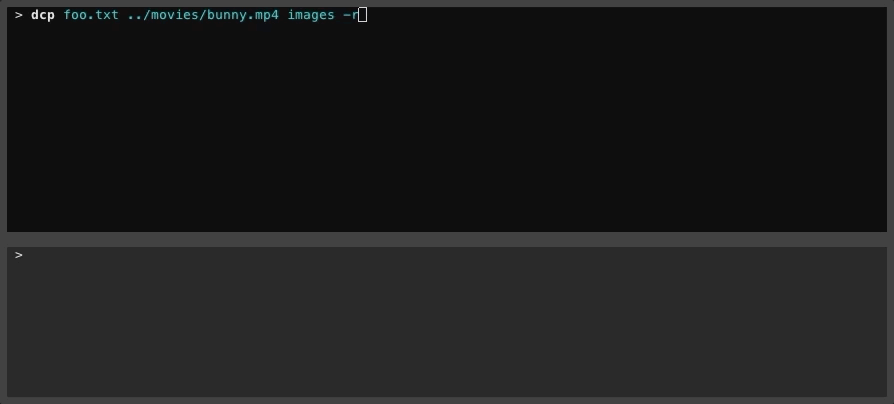

`dcp` - Dat Copy
========

> Remote file copy, powered by the Dat protocol.

[](https://circleci.com/gh/tom-james-watson/workflows/dat-cp/tree/master)
[](https://www.npmjs.com/package/dat-cp)
[](https://www.npmjs.com/package/dat-cp)
[](https://www.npmjs.com/package/dat-cp)

`dcp` copies files between hosts on a network using the peer-to-peer [Dat network](https://datproject.org/). `dcp` can be seen as an alternative to tools like `scp`, removing the need to configure SSH access between hosts. This lets you transfer files between two remote hosts, without you needing to worry about the specifics of how said hosts reach each other.

`dcp` requires zero configuration and is secure, fast, and peer-to-peer.

### Example

]

### How `dcp` works

`dcp` will create a dat archive for a specified set of files or directories and, using the generated public key, lets you download said archive from a second host. Any data shared over the network is encrypted using the public key of the archive, meaning data access is limited to those who have access to said key. For more information on how Dat works, you can browse [the docs](https://docs.datproject.org/) or [read their whitepaper](https://github.com/datproject/docs/blob/master/papers/dat-paper.pdf).

### Advantages over plain [dat](github.com/datproject/dat)

`dcp` is designed to have an API that is more reminiscent of `scp` and `rsync`. The standard cli `dat` program requires the additional mental overhead of understanding how the underlying Dat protocol works. `dat` forces you to share a single whole folder, whilst with `dcp` you can copy an arbitrary set of paths. `dat` also pollutes the filesystem with metadata files, whereas with `dcp` these are kept in-memory instead.

## Installation

```
npm i -g dat-cp
```

## Usage

```
Usage: dcp [options] {source ... | key}

Dat Copy - remote file copy, powered by the dat protocol.

Options:
  -V, --version    output the version number
  -r, --recursive  recursively copy directories
  -n, --dry-run    show what files would have been copied
  -v, --verbose    verbose mode - prints extra debugging messages
  -h, --help       output usage information
```

### Sending files

```bash
> dcp foo.txt ../movies/big.mp4 images -r
foo.txt                                            [========================================] 100% | 0s | 4.00B
big.mp4                                            [========================================] 100% | 5s | 798.95MB
images/cat.jpg                                     [========================================] 100% | 0s | 5.58KB
images/dog.jpg                                     [========================================] 100% | 0s | 431.81KB
images/landscape.jpg                               [========================================] 100% | 0s | 42.67KB

Total: 6 files (799.41MB)

Paste files on another host with:

        dcp b194683f099a4834553ed972e9e16b748ef3cebdfde8883bbade03bc56ee884b

Upload: 0B (0B/s)
```

### Receiving files

```bash
> dcp b194683f099a4834553ed972e9e16b748ef3cebdfde8883bbade03bc56ee884b
foo.txt                                            [========================================] 100% | 0s | 4.00B
big.mp4                                            [========================================] 100% | 8s | 798.95MB
images/cat.jpg                                     [========================================] 100% | 0s | 5.58KB
images/dog.jpg                                     [========================================] 100% | 0s | 431.81KB
images/landscape.jpg                               [========================================] 100% | 0s | 42.67KB

Total: 6 files (799.41MB)
>
```

## Development

Install dependencies:

```
npm i
```

Run the tests:

```
npm t
```

Test the CLI executable

```
npm run cli -- foo.txt -v
```

*Note the `--` preceding the arguments.*
